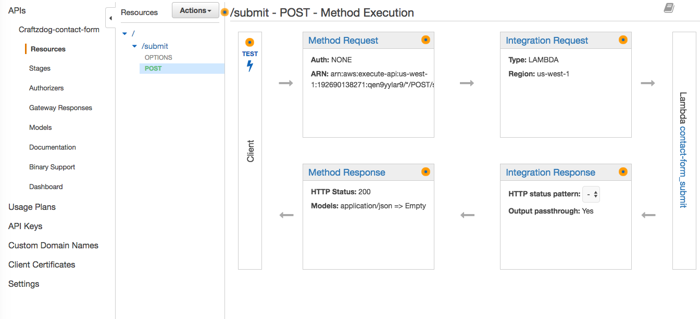

# send-email-lambda

Simple email sender running on Lambda.
It sends emails via AWS SES.
It comes in handy when you would add a contact form to your static website.

## Prerequisites

 * Apex - http://apex.run/
 * An email address verified with AWS SES

## Prepare

Init your project

```
git clone git@github.com:craftzdog/send-email-lambda.git
cd send-email-lambda
apex init
> Project nane: send-email
```

Edit your `project.json` file based on `project.json.example` like:

```json
{
  "name": "send-email",
  "description": "Simple email transmitter",
  "memory": 128,
  "timeout": 5,
  "environment": {},
  "runtime": "nodejs6.10",
  "role": "<YOUR_IAM_ROLE>"
}
```

## Configure

Edit `functions/submit/function.json` as you like:

```
{
  "environment": {
    "SES_REGION": "us-west-2",
    "FROM_NAME": "Craftzdog Contact Form",
    "FROM_EMAIL": "<YOUR_AUTOMATED_EMAIL_SENDER>",
    "TO_EMAIL": "<EMAIL_TO_RECEIVE>"
  }
}
```

 * `SES_REGION`: The AWS region for the SES
 * `FROM_NAME`: Sender name like "Contact Form"
 * `FROM_EMAIL`: The email address you would receive from. e.g., contact@example.com
 * `TO_EMAIL`: Your personal email address to receive emails.

### Add a permission to send emails to the IAM role

Add following policy to your lambda's IAM role (ex. `send-email_lambda_function`) that allows the lambda function to use SES.sendEmail with policy name `send-email_submit`:

```json
{
    "Version": "2012-10-17",
    "Statement": [
        {
            "Sid": "Stmt1504526549000",
            "Effect": "Allow",
            "Action": [
                "ses:SendEmail"
            ],
            "Resource": [
                "*"
            ]
        }
    ]
}
```

## Deploy and test sending emails

At the project top directory:

```sh
apex deploy
```

You can run the lambda function manually with below command:

```sh
echo -n '{ "subject": "hello", "body": "world" }' | apex invoke submit
```

And you will get an email to the configured address.

## Publish on the Web

### API Gateway

Configure your API Gateway like this:



And deploy the API.

### Swagger definitions

See [the swagger YAML file](/send-email-swagger.yaml) as an example.

### API

#### POST `<YOUR_API_ENTRYPOINT>/submit`

It accepts JSON data with 2 fields:

 * `subject`: The message subject
 * `body`: The message body

## License

MIT, Copyright 2017 by Takuya Matsuyama &lt;hi@craftz.dog&gt;
